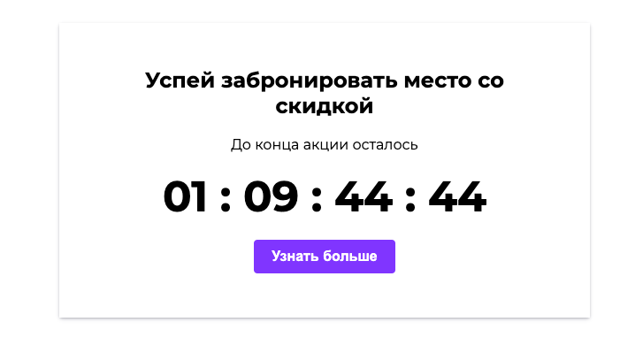

# Timer

* [Посмотреть можно здесь](https://codepen.io/VladimirAlbrekht/pen/ZEVeXam)

Таймер обратного отсчета(Дни/часы/минуты/секунды)

## Цель: 

Создать собственный таймер обратного отсчета, который в дальнейшем может быть использован в новых проектах.

## Использованныe технологии:
* HTML
* CSS
* JS

## При использовании данного кода не забудьте:
* Изменить дату окончания вашей акции в переменной 'endDate'
* Изменить стили для соответсвия вашему дизайну
* Если вы используете собственные классы. То не забудьте заменить их в файле 'index.js'

 
